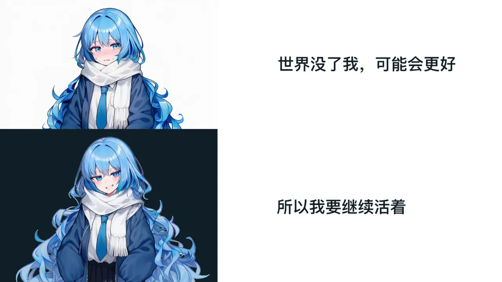

  

<h1 align="center">Ciallo～(∠・ω< )⌒☆</h1>

  <b>这里是 Sheyiyuan</b> 

末流 985 统计学本科在读 | 全栈开发者 | 开源爱好者

<i>按兴趣写点我需要的「无聊」东西</i>

  
  

  <table>
    <tr>
      <td align="center" style="border: none;">
        
      </td>
      <td align="center" style="border: none;">
        
      </td>
    </tr>
  </table>

### 技术栈 Tech Stack

  
  
  
  
  
  
  
  
  
  
  
  
  
  
  

### 精选项目 Featured Projects

<table align="center">
  <tr>
    <td width="50%" valign="top" align="center">
      
    </td>
    <td width="50%" valign="top" align="center">
      
    </td>
  </tr>
</table>

### 技术特点 Tech Highlights

- **全栈开发实践**：从前端到后端独立完成项目，享受端到端开发的乐趣
- **分析遇上工程**：用数据驱动决策，结合工程化思维解决实际问题
- **多平台经验**：Web、桌面、小程序都有实践，追求稳定可靠的用户体验
- **工程化思维**：偏爱模块化、可扩展的设计，让代码易维护、好扩展

### 社区参与 Community

- **技术博客**：在 [blog.sheyiyuan.cn](https://blog.sheyiyuan.cn) 分享学习笔记与实践经验
- **开源贡献**：积极参与开源项目，为社区贡献代码
- **技术交流**：乐于分享技术见解，探讨解决方案

### 当前进展 Current Focus

**学习ing :**
- **CS61ABC 系列课程** - 深入理解计算机系统基础
- **React 框架** - 提升前端开发能力，构建现代化 Web 应用

**开发ing :**
- **Half-Beat Player** - 基于 Wails 的跨平台音乐播放器

