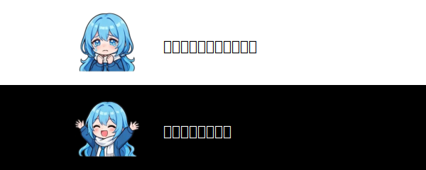
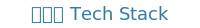
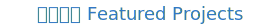
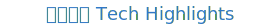
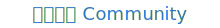
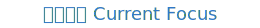

  

<h1 align="center">Ciallo～(∠・ω< )⌒☆</h1>

  <b>这里是 Sheyiyuan</b> 

中南大学本科生 | 统计学专业在逃选手 | 全栈开发者 | 开源爱好者

<i>按兴趣写点我需要的「无聊」东西</i>

  
  

  <table>
    <tr>
      <td align="center" style="border: none;">
        
      </td>
      <td align="center" style="border: none;">
        
      </td>
    </tr>
  </table>

 

  

 

<h3 align="center">
  
  
</h3>

  
  
  
  
  
  
  
  
  
  
  
  
  
  
  
  

<h3 align="center">
  
  
</h3>
<table align="center">
  <tr>
    <td width="50%" valign="top" align="center">
      
    </td>
    <td width="50%" valign="top" align="center">
      
    </td>
  </tr>
  <tr>
    <td width="50%" valign="top" align="center">
      
    </td>
    <td width="50%" valign="top" align="center">
      
    </td>
  </tr>
</table>

<h3 align="center">
  
  
</h3>

- **全栈开发实践**：从前端到后端独立完成项目，关注端到端开发的完整闭环
- **多平台经验**：在 Web、桌面、小程序等方向都有实践~~全是三分钟热度~~
- **工程化思维**：偏爱模块化、可扩展的设计，让代码更易维护、好扩展
- **服务器运维**: 熟悉 Linux 环境，独立部署和维护服务器

<h3 align="center">
  
  
</h3>

- **技术博客**：在 [blog.sheyiyuan.com](https://blog.sheyiyuan.com) 分享学习笔记与实践经验
- **社区交流**：乐于分享技术见解，探讨解决方案。创建组织 [故桌 TRPG 开发团队](https://github.com/Narra-Table)，把技术与热情传递给更多像我一样对工程感兴趣的人。

<h3 align="center">
  
  
</h3>

**学习ing :**
- **flutter 框架** - 这移动端就没有好用的 web 套壳吗？
- **C# 语言（Godot）** - 万一这 b 游戏真能做出来呢？
- **Agent 开发** - 这是半拍双手的延伸！kakaa！

**开发ing :**
- **故桌 TRPG** - 专注于跑团体验的下一代 TRPG 平台
- **Half Pi** - 分离的跨设备 AI 助理，全局记忆统一 + 远端节点执行
